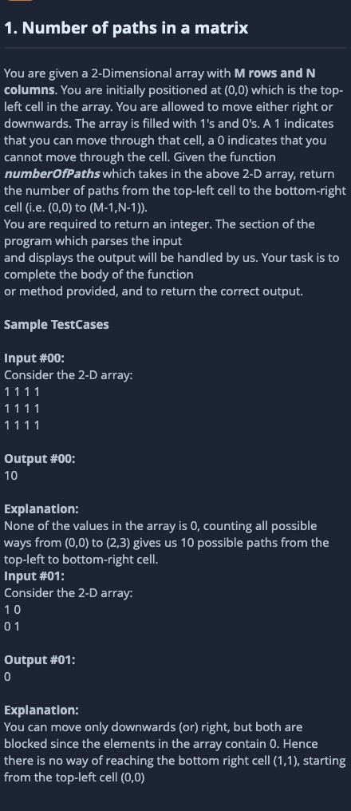

**The solution:**

```math
ways[i][j] = ways[i-1][j] + ways[i][j-1]
```

```cpp
grid:(1 means dead)   ways:

0 0 1 0 0             1 1 0 0 0
0 0 0 0 0             1 2 2 2 2
0 1 0 0 1             1 0 2 4 0
1 0 0 0 0             0 0 2 6 6
0 0 0 0 0             0 0 2 8 14
```